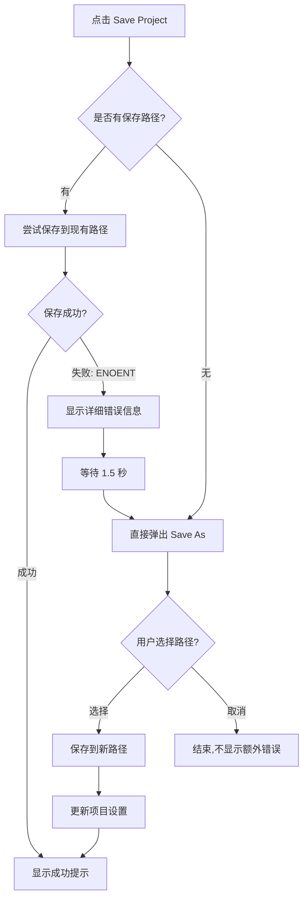

# Save Project Error Handling Enhancement - Walkthrough

## 修改内容

### 问题
当项目的保存路径无效时（例如文件或目录不存在），点击"Save Project"只会显示错误提示，但无法重新选择保存位置，导致项目无法保存。

### 解决方案
修改了 `App.tsx` 中的 `saveProject` 函数，实现了智能的错误恢复机制。

## 实现细节

### 修改位置
**文件**: `App.tsx` (第259-285行)

### 核心逻辑

当保存失败并遇到 ENOENT 错误时：

1. **显示详细错误信息** (保留原始错误消息)
   ```typescript
   showNotification(`Failed to save: ${saveResult.error}`, 'error');
   ```
   - 显示完整的错误路径，例如：
   - `"Failed to save: ENOENT: no such file or directory, open 'D:\python_workspace\Claude_Project\ProGantt-win32-x64\Data\TestProject.json'"`

2. **等待用户查看** (1.5秒延迟)
   ```typescript
   await new Promise(resolve => setTimeout(resolve, 1500));
   ```

3. **自动弹出 Save As 对话框**
   ```typescript
   const saveAsResult = await window.electronAPI.saveProjectAs(jsonString);
   ```

4. **更新项目设置** (如果用户选择了新路径)
   ```typescript
   const newSettings = {
       ...settings,
       projectSavePath: saveAsResult.filePath,
       projectFilename: saveAsResult.filePath.split('\\').pop()?.replace('.json', '')
   };
   setSettings(newSettings);
   ```

## 用户体验流程



## 打包验证

### 构建和打包步骤

1. **前端构建**
   ```bash
   npm run build
   ```
   - 输出: `dist/assets/index-Dbz_FtfO.js` (228.43 kB)
   - 时间: 2025/11/24 16:28:14

2. **Electron 打包**
   ```bash
   npx electron-packager . ProGantt --platform=win32 --arch=x64 --out=release-packager --overwrite --icon="public/icon.ico" --ignore="^/src" --ignore="^/node_modules" --ignore="^/.git" --ignore="^/.vscode" --ignore="^/release" --ignore="^/release-packager" --ignore="^/public"
   ```
   - 输出路径: `release-packager\ProGantt-win32-x64\`

### 文件时间戳验证

| 文件 | 最后修改时间 | 说明 |
|------|-------------|------|
| `App.tsx` | 2025/11/24 16:23:19 | ✅ 包含最新的保存逻辑修改 |
| `index-Dbz_FtfO.js` | 2025/11/24 16:28:14 | ✅ 最新构建的前端代码 |
| `ProGantt.exe` | 2025/11/24 16:29:05 | ✅ 最新打包的可执行文件 |

## 测试场景

### 场景 1: 路径有效
- **操作**: 点击 Save Project
- **结果**: 直接保存成功，显示 "Project saved successfully!"

### 场景 2: 路径无效 (ENOENT)
- **操作**: 点击 Save Project
- **结果**: 
  1. 显示错误: "Failed to save: ENOENT: no such file or directory, open '[完整路径]'"
  2. 等待 1.5 秒
  3. 自动弹出 Save As 对话框
  4. 用户选择新路径后保存成功
  5. 项目设置自动更新为新路径

### 场景 3: 用户取消 Save As
- **操作**: 在 Save As 对话框中点击取消
- **结果**: 静默结束，不显示额外错误

## 应用位置

**可执行文件路径**: 
```
D:\python_workspace\Claude_Project\WebBase_Project_Gantt\release-packager\ProGantt-win32-x64\ProGantt.exe
```

## 总结

✅ **保留了详细的错误提示** - 用户可以看到完整的无效路径  
✅ **自动恢复机制** - 无需手动操作即可重新选择保存位置  
✅ **用户友好** - 取消操作不会产生额外的错误提示  
✅ **设置同步** - 新路径自动保存到项目设置中  
✅ **已验证打包** - 最新代码已成功打包到可执行文件中
